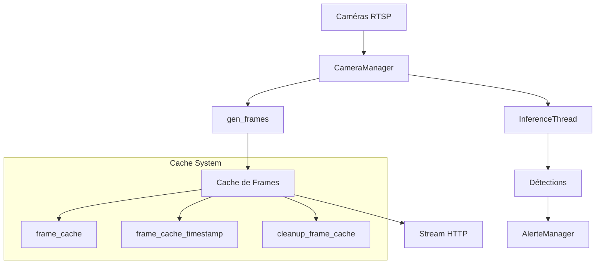
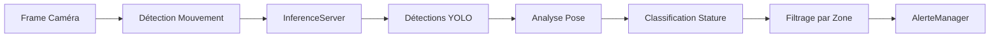

# 📹 Système de Cache de Frames et Architecture de l'Application

## 🎯 Vue d'ensemble

L'application **4iSafeCross** utilise un système sophistiqué de gestion des frames vidéo avec mise en cache pour optimiser les performances et réduire la latence lors du streaming vidéo en temps réel. Ce document explique le fonctionnement détaillé du système.

## 🏗️ Architecture Générale



## 📊 Système de Cache de Frames

### 🔧 Configuration du Cache

```python
FRAME_CACHE_DURATION = 0.15  # 150ms de cache
FRAME_QUALITY_OPTIMIZED = 70  # Qualité JPEG à 70%
```

### 🏪 Structure des Données

```python
# Cache principal des frames encodées
frame_cache = {
    camera_id: encoded_jpeg_bytes,
    ...
}

# Timestamps pour la gestion de l'expiration
frame_cache_timestamp = {
    camera_id: timestamp,
    ...
}

# Statistiques de performance
cache_performance_stats = {
    'hits': 0,           # Nombre de fois où le cache a été utilisé
    'misses': 0,         # Nombre de fois où une nouvelle frame a été générée
    'total_generation_time': 0.0,  # Temps total de génération
    'last_reset': time.time()
}
```

### ⚡ Fonctionnement du Cache

#### 1. **Vérification du Cache**
```python
# Récupération de la frame mise en cache
with frame_cache_lock:
    cached_frame = frame_cache.get(cid)
    cache_time = frame_cache_timestamp.get(cid, 0)

# Vérification de la validité (âge < 150ms)
if cached_frame is not None and current_time - cache_time < FRAME_CACHE_DURATION:
    # CACHE HIT - Utilisation de la frame mise en cache
    yield frame_data
```

#### 2. **Génération de Nouvelle Frame**
```python
# CACHE MISS - Génération d'une nouvelle frame
frame = manager.get_frame_array(cam_id)
if frame is not None:
    # Traitement de la frame (overlay, détections, etc.)
    # Encodage JPEG
    ret, buffer = cv2.imencode('.jpg', frame, [cv2.IMWRITE_JPEG_QUALITY, 70])
    
    # Mise en cache
    with frame_cache_lock:
        frame_cache[cid] = frame_bytes
        frame_cache_timestamp[cid] = current_time
```

#### 3. **Nettoyage Automatique**
```python
def cleanup_frame_cache():
    """Nettoie les frames expirées toutes les 3 secondes"""
    current_time = time.time()
    for cam_id, timestamp in frame_cache_timestamp.items():
        # Expiration après 3x la durée du cache (450ms)
        if current_time - timestamp > FRAME_CACHE_DURATION * 3:
            # Suppression de l'entrée expirée
            frame_cache.pop(cam_id, None)
            frame_cache_timestamp.pop(cam_id, None)
```

## 🎥 Système de Génération de Frames

### 🔄 Pipeline de Traitement

1. **Acquisition** : `manager.get_frame_array(cam_id)`
2. **Vérification** : Validation de la frame et création d'une copie modifiable
3. **Overlay des Zones** : Application des zones de détection via `get_zone_overlay()`
4. **Affichage des Détections** : Rectangles colorés selon la stature détectée
5. **ROI Debug** : Affichage optionnel des zones de mouvement
6. **Encodage** : Compression JPEG à 70% de qualité
7. **Mise en Cache** : Stockage pour réutilisation

### 🎨 Overlays et Annotations

```python
# Couleurs par stature (RGB → BGR pour OpenCV)
STATURE_COLORS = {
    'enfant': (0, 255, 0),      # Vert
    'adulte': (255, 165, 0),    # Orange  
    'assis': (255, 0, 255),     # Magenta
    'debout': (0, 255, 255),    # Cyan
    'marchant': (255, 255, 0),  # Jaune
    'inconnu': (0, 0, 255)      # Rouge
}

# Affichage des détections
for detection in detections:
    stature = detection.get("stature", "inconnu")
    color = STATURE_COLORS.get(stature, (0, 0, 255))
    cv2.rectangle(frame, (x1, y1), (x2, y2), color, 2)
    cv2.putText(frame, label, (x1, y1-10), cv2.FONT_HERSHEY_SIMPLEX, 0.5, color, 2)
```

## 🧠 Système d'Inférence et Détection

### 🔍 Pipeline de Détection



### 📡 Thread d'Inférence

Chaque caméra possède son propre thread d'inférence :

```python
# Création du thread d'inférence
thread = InferenceServerThread(
    home_dir=".",
    white_pixels_threshold=MOTIONTRESHOLD,
    get_frame_func=get_frame_func_factory(cid),
    detection_callback=detection_callback_factory(cid, MAIN_LOOP),
    stop_event=stop_event
)
```

### 🎯 Callback de Détection

```python
def detection_callback_factory(cid, main_loop):
    def detection_callback(detection_result):
        # Traitement des détections
        detections = detection_result.get("detections", [])
        
        # Ajout des zones à chaque détection
        for det in detections:
            zone_names = get_zone_for_detection(det, zones)
            det["zones"] = zone_names
        
        # Stockage dans la structure partagée
        with shared_detections_lock:
            shared_detections[cid] = detections_with_zone
        
        # Déclenchement des alertes si nécessaire
        if should_trigger_alert():
            asyncio.run_coroutine_threadsafe(
                alert_manager.on_detection(...), main_loop
            )
    return detection_callback
```

## 🌐 Streaming HTTP et Routes

### 📺 Route de Streaming

```python
@app.route('/video_feed/<int:cid>')
def video_feed(cid):
    """Stream MJPEG pour une caméra spécifique"""
    return Response(
        gen_frames(cid),
        mimetype='multipart/x-mixed-replace; boundary=frame'
    )
```

### 🔧 Routes de Contrôle

- `/toggle_stream/<cid>` : Activer/désactiver le stream vidéo
- `/toggle_detection/<cid>` : Activer/désactiver la détection
- `/toggle_roi_display/<cid>` : Afficher/masquer les ROI de mouvement
- `/set_motion_param/<cid>` : Modifier les paramètres de détection de mouvement
- `/cache_stats` : Statistiques du cache de frames
- `/clear_frame_cache` : Vider manuellement le cache

## 📊 Optimisations et Performance

### ⚡ Cache Performance

- **Hit Rate** : Pourcentage d'utilisation du cache vs génération
- **Temps de Génération** : Temps moyen pour créer une nouvelle frame
- **Taille du Cache** : Nombre d'entrées et taille mémoire utilisée

### 🎯 Optimisations Appliquées

1. **Limitation de Fréquence** : 10 FPS maximum (100ms entre frames)
2. **Cache Intelligent** : Réutilisation des frames récentes (150ms)
3. **Nettoyage Conservateur** : Expiration après 450ms (3x la durée)
4. **Logs Réduits** : Logging seulement tous les 10 événements
5. **Qualité JPEG Optimisée** : 70% pour équilibrer qualité/taille

### 📈 Métriques de Monitoring

```json
{
  "cache_duration_ms": 150,
  "frame_quality": 70,
  "total_entries": 2,
  "expired_entries": 0,
  "hit_rate_percent": 85.2,
  "average_generation_time_ms": 12.3,
  "total_requests": 1247,
  "cameras": {
    "0": {
      "age_ms": 45.2,
      "size_bytes": 15420,
      "is_fresh": true,
      "expired": false
    }
  }
}
```

## 🛠️ Configuration et Paramétrage

### 🎛️ Paramètres Globaux

```python
# Configuration des caméras
CAM_IDS = [
    f"rtsp://{login}:{password}@{host}:{port}/{stream}"
    for host in RTSP_HOST
]

# Seuils de détection
MOTIONTRESHOLD = 50  # Seuil de pixels blancs pour mouvement
ZONES_BY_CAMERA = {  # Zones de détection par caméra
    0: [{"name": "Zone1", "polygon": [...]}],
    1: [{"name": "Zone2", "rect": [x1,y1,x2,y2]}]
}
```

### 🎨 Gestion des Zones

```python
def get_zone_for_detection(det, zones):
    """Détermine dans quelles zones se trouve une détection"""
    x_centre = int((det["x_min"] + det["x_max"]) / 2)
    y_centre = int((det["y_min"] + det["y_max"]) / 2)
    
    matched_zones = []
    for zone in zones:
        if "polygon" in zone:
            # Test point-in-polygon
            if cv2.pointPolygonTest(zone["polygon"], (x_centre, y_centre), False) >= 0:
                matched_zones.append(zone["name"])
        elif "rect" in zone:
            # Test point-in-rectangle
            x1, y1, x2, y2 = zone["rect"]
            if x1 <= x_centre <= x2 and y1 <= y_centre <= y2:
                matched_zones.append(zone["name"])
    
    return matched_zones
```

## 🚨 Gestion des Erreurs

### 🛡️ Protection contre les Frames Nulles

```python
try:
    frame = frame.copy()  # Rendre la frame modifiable
    h, w = frame.shape[:2]
except Exception as e:
    logger.error(f"❌ Erreur lors de la copie de frame pour caméra {cid}: {e}")
    time.sleep(0.1)
    continue
```

### 🔄 Récupération Automatique

- **Reconnexion RTSP** : Test automatique des flux avant démarrage
- **Cache Resilient** : Continue même si le cache est corrompu
- **Thread Safety** : Utilisation de locks pour éviter les conditions de course

## 📝 Logs et Debugging

### 📊 Types de Logs

```python
# Logs de performance (réduits)
if cache_performance_stats['hits'] % 10 == 0:
    logger.debug(f"📋 Cache HIT pour caméra {cid} - Taux: {hit_rate:.1f}%")

# Logs d'erreur (toujours affichés)
logger.error(f"❌ Erreur encodage JPEG pour caméra {cid}")

# Logs de nettoyage
logger.debug(f"🧹 Nettoyage cache: suppression de {len(expired_cameras)} entrées")
```

### 🔍 Endpoints de Debug

- `/cache_stats` : Statistiques détaillées du cache
- `/debug_info` : Informations système (RAM, CPU, disque)
- `/api/inference/stats` : Statistiques d'optimisation de l'inférence

## 🚀 Démarrage et Configuration

### 🔧 Initialisation

```python
# 1. Configuration des logs
logs_settings()

# 2. Test des flux RTSP
results = CameraManager.test_rtsp_streams_parallel(CAM_IDS)
filtered_cam_ids = [cid for cid, ok in results.items() if ok]

# 3. Initialisation du gestionnaire de caméras
manager = CameraManager(filtered_cam_ids, frame_width=1920, frame_height=1080)

# 4. Démarrage des threads d'inférence
for i in range(len(CAM_IDS)):
    thread = InferenceServerThread(...)
    thread.start()
    inference_threads[i] = thread

# 5. Démarrage du nettoyage du cache
start_cache_cleanup()
```

### 🌐 Lancement du Serveur

```python
if __name__ == '__main__':
    from waitress import serve
    serve(app, host='0.0.0.0', port=5050)
```

---

## 📚 Résumé

Le système de cache de frames de **4iSafeCross** optimise les performances du streaming vidéo en :

1. **Réutilisant** les frames récentes (150ms) pour éviter la regénération
2. **Limitant** la fréquence à 10 FPS pour économiser les ressources
3. **Nettoyant** automatiquement les données expirées
4. **Monitornant** les performances via des métriques détaillées
5. **Gérant** robustement les erreurs et reconnexions

Cette architecture permet de servir efficacement plusieurs flux vidéo simultanés avec détection IA en temps réel tout en maintenant une latence faible et une utilisation optimale des ressources système.
